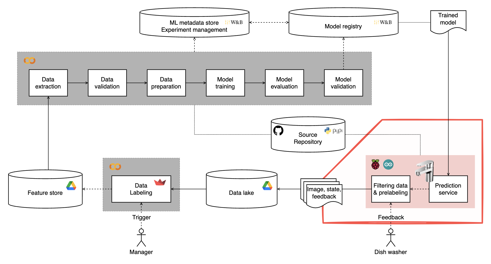
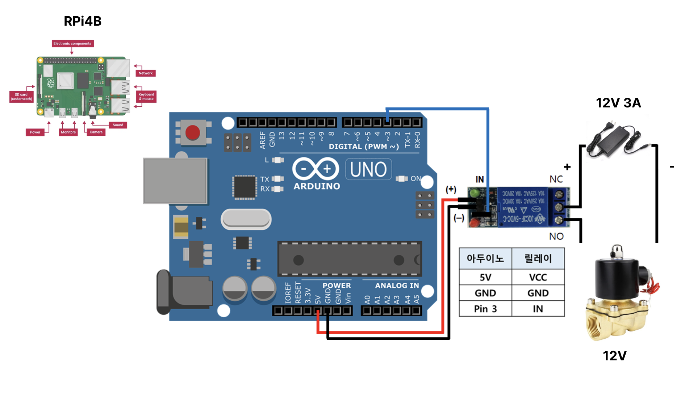

# RPI Runner for Autosink Project

<table>
<thead align="center">
  <tr>
    <th>자동으로 물이 켜짐</th>
    <th>자동으로 물이 꺼짐</th>
  </tr>
</thead>
<tbody align="center">
  <tr>
    <td></td>
    <td></td>
  </tr>
</tbody>
</table>


매년 주방에서 팔당댐을 세 번 채울 수 있을 만큼의 물이 낭비됩니다. 설거지 중 물을 틀어놓고 접시를 선반에 오르내리는 시간은 전체 설거지 시간의 10% 를 상회합니다. 이 프로젝트는 설거지할 때 낭비되는 물의 양을 줄이기 위해 컴퓨터 비전 기술과 사용자의 피드백을 활용하여 재학습되는 인공지능(MLOps)기술을 활용하여 자동 싱크대 수전 제어 시스템을 구축하는 것을 목표로 합니다. 라즈베리파이와 연결된 카메라를 통해 실시간으로 설거지 상황을 인식하고, 학습된 AI 모델의 판단에 따라 솔레노이드 밸브를 제어하여 물 공급을 자동으로 조절합니다. 사용자의 수도꼭지 직접 조작 등의 피드백을 수집하여 모델 업데이트에 활용하여 사용자의 설거지 패턴에 최적화된 물 절약 성능을 제공합니다.

## 이 저장소가 다루는 내용



이 저장소는 전체 MLOps 파이프라인 중 싱크대를 제어하는 라즈베리파이의 사용 부분을 다룹니다. 이 저장소에 포함되어 있는 기능은 다음과 같습니다.

1. 라즈베리파이에 연결된 카메라를 통해 설거지 과정을 실시간으로 촬영합니다.
2. 촬영된 이미지와 사용자 피드백 정보(수도꼭지 직접 조작 등)를 데이터 레이크에 업로드합니다.
3. 학습된 최신 AI 모델을 주기적으로 다운로드 받아 로컬에서 실행합니다.
4. 모델의 판단 결과에 따라 급수 밸브(솔레노이드 밸브)를 제어하여 물 공급을 자동 조절합니다.

이 외 전체 파이프라인 기능에 관해서는 [다음 저장소](https://github.com/slink-to-unlock/autosink-orchestra)를 참고하세요.

## 목차

- [설치](#설치)
- [빠른 시작](#빠른-시작)
- [라즈베리파이로 시작](#라즈베리파이로-시작)
  - [라즈베리파이 기본 세팅](#라즈베리파이-기본-세팅)
  - [라즈베리파이 환경 변수 설정](#라즈베리파이-환경-변수-설정)
  - [실행 명령 예시](#실행-명령-예시)
- [런타임 사용법](#런타임-사용법)
- [데이터레이크 업로드](#데이터레이크-업로드)
- [아두이노 소스코드](#아두이노-소스코드)
- [컨트리뷰션](#컨트리뷰션)

## 설치

이 저장소의 소스코드는 라즈베리파이에서 실행하는 것을 기본으로 설계되었습니다. 하지만, 로컬 컴퓨터에서 동영상을 이용해 작동시켜보고자 하는 경우에도 실행 해볼 수 있습니다.

아래 명령어를 입력하여 설치합니다.

```python
pip install snailshell
```

## 빠른 시작

```python
python3 -m snailshell.main \
--model_name resnet \
--use_camera \
--without_arduino \
--visualize \
--weight_path snailshell/models/model-ai-sink-run \
--wandb_project your_wandb_project \
--wandb_artifact your_wandb_artifact \
--not_upload_feedback
```

카메라가 없는 환경인 경우, `--use_camera` 옵션 대신 `--video_path [your_video_path]` 옵션을 사용하세요.

## 라즈베리파이로 시작



본격적으로 라즈베리파이에서 실행하고자 한다면, 필수적으로 다음 하드웨어들을 준비해야 합니다.

- 라즈베리파이 4 모델 B, 2GB 이상
- 라즈베리파이 카메라모듈 V2 이상
- 5V 릴레이 모듈
- 12V 전압의 솔레노이드 밸브 ([DN15_01 DC12V](https://www.coupang.com/vp/products/6547035251?itemId=14600648419&vendorItemId=87832075014&q=DC12V+%EC%86%94%EB%A0%88%EB%85%B8%EC%9D%B4%EB%93%9C&itemsCount=36&searchId=62e5e7e446884e6b8f50ccbf8f1f82fb&rank=3&isAddedCart=))
- 수전

### 라즈베리파이 기본 세팅

한글 폰트를 설치합니다.

```python
sudo apt-get install -y fonts-unfonts-core ibus ibus-hangul
sudo reboot
```

### 라즈베리파이 환경 변수 설정

본격적으로 라즈베리파이에서 실행하고자 한다면, 필수적으로 다음 환경변수들이 설정되어야 합니다.

1. `DRIVE_API_KEY_PATH`: Google Drive API 키 파일의 경로입니다. 이는 데이터와 결과를 Google Drive에 업로드하기 위한 권한을 위해 필요합니다.
2. `DRIVE_FOLDER_ID`: 데이터레이크로 사용할 구글 드라이브 폴더의 ID입니다. end-to-end 파이프라인 구축을 위해 정확히 어떤 폴더를 사용해야 하는지는 [다음 저장소](https://github.com/slink-to-unlock/autosink-orchestra)의 ‘google drive 준비’ 내용을 참고하면 됩니다.
3. `WANDB_API_KEY`: 모델을 다운로드받기 위해 사용되는 weight and bias 의 api key 입니다. [다음 저장소](https://github.com/slink-to-unlock/autosink-orchestra)의 파이프라인을 실행하면 모델이 WandB에 저장됩니다.

위 세 가지 환경변수는 프로그램의 핵심 기능을 위해 반드시 설정되어야 합니다. `DISCORD_WEBHOOK_URL`은 선택사항으로, 설거지 작업 완료 시 디스코드로 알림을 보내고 싶은 경우에만 설정하면 됩니다.

```bash
export WANDB_API_KEY='your_wandb_api_key'
export DRIVE_API_KEY_PATH='your_google_drive_api_key'
export DRIVE_FOLDER_ID='your_google_drive_folder_id'

# 설거지 종료시 디스코드에 알림 발송 기능. 선택사항.
export DISCORD_WEBHOOK_URL='your_discord_webhook_url'
```

### 실행 명령 예시

```bash
python3 -m snailshell.main \
--use_camera \
--picamera_module_backend \
--download_model \
--wandb_project your_wandb_project_name \
--wandb_artifact your_wandb_artifact_name \
--model_name resnet \
--visualize \
--not_upload_feedback
```

- `--picamera_module_backend`: `picamera` 모듈을 사용하도록 지정합니다. 이 옵션을 지정하지 않으면 OpenCV 백엔드를 사용합니다. 웹캠을 사용하고자 하는 경우 유용할 수 있습니다.
- `--download_model`: 최신 모델 가중치를 모델 레지스트리(wandb)에서 다운로드합니다.
- `--wandb_project`: 모델이 저장되어 있는 wandb 프로젝트 이름을 지정합니다. 모델 다운로드를 수행하려면 필수입니다. `your_wandb_project_name` 을 변경해서 사용하세요.
- `--wandb_artifact`: 최신 모델이 저장되어 있는 wandb 프로젝트의 artifact 이름을 지정합니다. 모델 다운로드를 수행하려면 필수입니다. `your_wandb_artifact_name` 을 변경해서 사용하세요.
- `--model_name`: 사용할 모델을 지정합니다. 사실상 `resnet` 만 지원하는 상태이며, 추가적으로 지원하고자 하는 경우 소스코드를 수정해야 합니다.
- `--without_arduino`: 아직 아두이노가 준비되지 않은 경우, 이 옵션을 포함시키세요.
- `--user_id`: 사용자 ID를 입력합니다. 기본값은 `user_1234` 입니다. 이 값은 데이터레이크에 업로드되는 로그에 포함되어 있습니다. 여러 개의 수전(라즈베리파이)에 프로그램을 배포하고자 하는 경우 유용합니다.
- `--not_upload_feedback`: 모델의 구동 중 생성된 피드백 데이터를 데이터레이크에 업로드할지에 대한 유무입니다. 이 값을 설정할 경우 피드백 데이터가 데이터레이크에 업로드 되지 않고 모델을 재학습 할 수 없습니다.

### 런타임 사용법


이 프로그램은 설거지 과정에서 사용자의 행동을 모니터링하고 피드백을 수집하기 위해 다음과 같은 키 입력을 받습니다.

- `0` 키: 사용자가 수도꼭지를 닫았음을 나타냅니다.
- `1` 키: 사용자가 수도꼭지를 열었음을 나타냅니다.
- `r` 키: 사용자가 물을 필요로 하나 AI 모델에 의해 솔레노이드 밸브가 닫혀 물이 나오지 않을 때, 사용자가 수도꼭지를 '딸깍 딸깍' 두 번 열고 닫는 행위를 나타냅니다. 이 경우 물이 강제로 토출됩니다.

이 키들은 자석 센서의 역할을 대신합니다. 자석 센서를 수도꼭지에 직접 부착하여 개폐 상태를 감지하고자 하였으나 현실적인 어려움으로 인해 키 입력으로 대체합니다. `q` 키를 입력하면 프로그램을 종료합니다. 이때 키 입력은 opencv 를 통해 이루어지므로, `--visualize` 옵션이 켜져 있어야 합니다.


사용 예시:

1. 프로그램 실행 후 사용자가 수도꼭지를 열면 `1`을 누릅니다.
2. 사용자가 수도꼭지를 받으면 `0`을 누릅니다.
3. 만약 사용자가 물을 필요로 하는데 AI 모델이 밸브를 닫아 물이 나오지 않는다면, `r`을 눌러 물을 강제로 토출시킵니다.
4. 설거지를 마치고 프로그램을 종료하려면 `q`를 누릅니다.

### 데이터레이크 업로드

이 저장소는 모델 재학습을 위해 모델 판단이 잘못된 상황을 재학습 데이터로 사용합니다. `--not_upload_feedback` 를 설정하지 않았을 경우 모델 사용이 종료된 후 업로드 되는 피드백 데이터는 다음과 같습니다.

- 사용자가 수도꼭지를 닫았지만 모델은 수도꼭지를 열어야 한다고 판단한 상황: 자석센서의 값이 0이고 모델의 판단이 1인 경우. (키보드에서는 `0`값)
- 사용자가 피드백을 준 상황: 사용자는 물을 원하지만 모델이 물을 주지 않아 수도꼭지를 두 번 조작한 경우. (키보드에서는 `r`값)

데이터를 저장하고 업로드하는 형식에 관해서는 [다음 저장소](https://github.com/slink-to-unlock/autosink-data-elt)를 참고하세요.

<table>
<thead align="center">
  <tr>
    <th>재학습 전</th>
    <th>재학습 후</th>
  </tr>
</thead>
<tbody align="center">
  <tr>
    <td></td></th>
    <td></td>
  </tr>
</tbody>
</table>

### 아두이노 소스코드

아두이노는 다음 소스코드를 사용하여 컴파일합니다.

```c
char cmd;

void setup() // 1.
{
  pinMode(13, OUTPUT);  // 2. 8번 핀을 출력으로 설정합니다.
  // 시리얼 통신 시작 (boadrate: 9600)
  Serial.begin(9600);
}

void loop() // 3.
{
  // 컴퓨터로부터 시리얼 통신이 전송되면, 한줄씩 읽어와서 cmd 변수에 입력
  if (Serial.available())
  {
    cmd = Serial.read();

    if (cmd == '1')
    {
      Serial.println("아두이노: 1");
      digitalWrite(13, HIGH); // 4. HIGH: 전압이 5V(아두이노 보드 전압)로 설정됩니다.
      delay(10);
    }
    else if (cmd == '0')
    {
      Serial.println("아두이노: 0");
      digitalWrite(13, LOW); // 6. LOW: 전압이 0V로 설정됩니다.
      delay(10);
    }
    else if (cmd != '0' && cmd != '1')
    {
      Serial.println("어쩔");
      delay(1);
    }
  }
}
```

## 컨트리뷰션

소스코드 자체에 부족한 점이 매우 많음을 양해해 주세요. 프로젝트 개선과 적극적인 기여는 언제나 환영입니다. 문의가 있는 경우 이슈를 남겨주세요.
